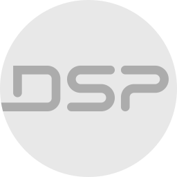

# ioBroker.mini_dsp

[](https://www.npmjs.com/package/iobroker.mini_dsp)
[](https://www.npmjs.com/package/iobroker.mini_dsp)


[](https://david-dm.org/stesto/iobroker.mini_dsp)

## What is it?

An ioBroker adapter which allows you to control your miniDSP device via USB.

## Supported / Tested Devices

miniDSP 2x4HD

## Features implemented

-   [x] Master Mute
-   [x] Maste Volume
-   [x] Input Select
-   [x] Input Gain
-   [x] Input Mute
-   [ ] Input PEQ
-   [x] Output Gain
-   [x] Output Mute
-   [x] Output Invert
-   [ ] Output PEQ
-   [ ] Output Xover
-   [ ] Output Comp
-   [ ] Output FIR
-   [ ] Output Delay
-   [ ] Routing
-   [ ] Routing Gain

## Installation

**Linux:**

You have to grant hid permissions in order to allow this adapter to communicate with your device.

Create a new file called `99-minidsp-udev.rules` in the directory `/etc/udev/rules.d` with the following content:

```
KERNEL=="hidraw*", ATTRS{idVendor}=="2752", ATTRS{idProduct}=="0011", MODE="0666", GROUP="plugdev"
SUBSYSTEM=="usb", ATTRS{idVendor}=="2752", ATTRS{idProduct}=="0011", MODE="0666", GROUP="plugdev"
```

After replugging your device you need to (re)start the adapter and you shoud be good to go.

**Windows / Mac OS:**

_currently not supported_

## Changelog

<!--
    Placeholder for the next version (at the beginning of the line):
    ### **WORK IN PROGRESS**
-->

### **WORK IN PROGRESS**

-   (stesto) initial release

## License

MIT License

Copyright (c) 2022 stesto

Permission is hereby granted, free of charge, to any person obtaining a copy
of this software and associated documentation files (the "Software"), to deal
in the Software without restriction, including without limitation the rights
to use, copy, modify, merge, publish, distribute, sublicense, and/or sell
copies of the Software, and to permit persons to whom the Software is
furnished to do so, subject to the following conditions:

The above copyright notice and this permission notice shall be included in all
copies or substantial portions of the Software.

THE SOFTWARE IS PROVIDED "AS IS", WITHOUT WARRANTY OF ANY KIND, EXPRESS OR
IMPLIED, INCLUDING BUT NOT LIMITED TO THE WARRANTIES OF MERCHANTABILITY,
FITNESS FOR A PARTICULAR PURPOSE AND NONINFRINGEMENT. IN NO EVENT SHALL THE
AUTHORS OR COPYRIGHT HOLDERS BE LIABLE FOR ANY CLAIM, DAMAGES OR OTHER
LIABILITY, WHETHER IN AN ACTION OF CONTRACT, TORT OR OTHERWISE, ARISING FROM,
OUT OF OR IN CONNECTION WITH THE SOFTWARE OR THE USE OR OTHER DEALINGS IN THE
SOFTWARE.
